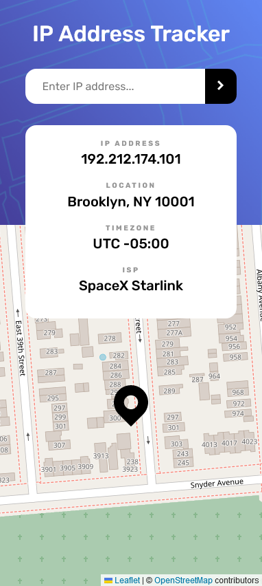
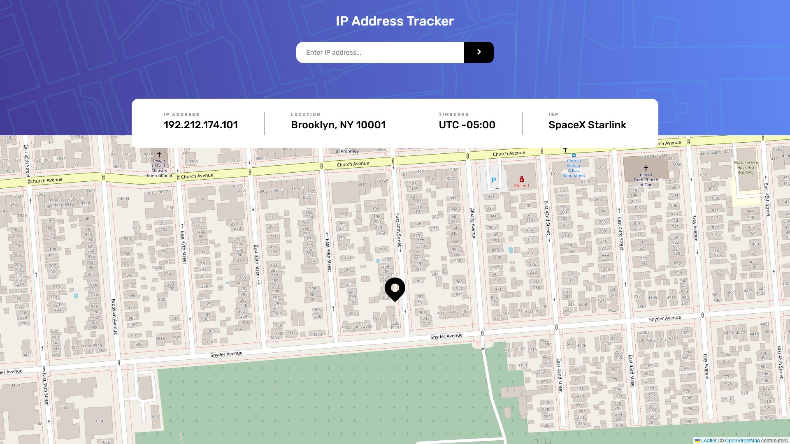

# Frontend Mentor - IP address tracker solution

This is a solution to the [IP address tracker challenge on Frontend Mentor](https://www.frontendmentor.io/challenges/ip-address-tracker-I8-0yYAH0). Frontend Mentor challenges help you improve your coding skills by building realistic projects.

## Table of contents

- [Overview](#overview)
  - [The challenge](#the-challenge)
  - [Screenshot](#screenshot)
  - [Links](#links)
- [My process](#my-process)
  - [Built with](#built-with)
  - [What I learned](#what-i-learned)
  - [Continued development](#continued-development)
- [Author](#author)

## Overview

### The challenge

Users should be able to:

- View the optimal layout for each page depending on their device's screen size
- See hover states for all interactive elements on the page
- See their own IP address on the map on the initial page load
- Search for any IP addresses or domains and see the key information and location

### Screenshot




### Links

- Solution URL: [GitHub](https://github.com/Sengsith/ip-address-tracker)
- Live Site URL: [Netlify](https://ahreo-iptracker.netlify.app/)

## My process

### Built with

- Semantic HTML5 markup
- CSS custom properties
- Flexbox
- Mobile-first workflow
- [React](https://reactjs.org/) - JS library
- [SASS](https://sass-lang.com/) - CSS Preprocessor
- [Leaflet](https://leafletjs.com/) - JS Library for maps
- [React-Leaflet](https://react-leaflet.js.org/) - React components for Leaflet maps

### What I learned

This is on of the few times working with an actualy API key so one key topic I learned was how to hide my API key properly. This was done on netlify's side though as it seems netlify's hosting is purely for static sites so I don't have much room for a mini backend. This is my first time working with react leaflet so I had to research a lot about how to change various options on the map. I had a big issue with the way my leaflet map was rendering to my app but figured that I was missing the css link in my `index.html`

```html
<link
  rel="stylesheet"
  href="https://unpkg.com/leaflet@1.9.4/dist/leaflet.css"
  integrity="sha256-p4NxAoJBhIIN+hmNHrzRCf9tD/miZyoHS5obTRR9BMY="
  crossorigin=""
/>
```

```jsx
<MapContainer
  ref={mapRef}
  center={markerPosition}
  zoom={18}
  scrollWheelZoom={true}
  zoomControl={false}
>
  <TileLayer
    attribution='&copy; <a href="https://www.openstreetmap.org/copyright">OpenStreetMap</a> contributors'
    url="https://{s}.tile.openstreetmap.org/{z}/{x}/{y}.png"
  />
  <Marker position={markerPosition} icon={customIcon}></Marker>
</MapContainer>
```

I changed a few options with the map container such as `zoom`, `scrollWheelZoom` and `zoomControl`. I also got to use a leaflet method `flyTo` which is called whenever my `resultObject` changes so that the map changes as well.

### Continued development

I want to continue practicing with React as it seems to be the most enjoyable part of building projects for me. I had issues creating my `ResultCard` component so I still need more practice with my CSS skills.

## Author

- Frontend Mentor - [@sengsith](https://www.frontendmentor.io/profile/Sengsith)
